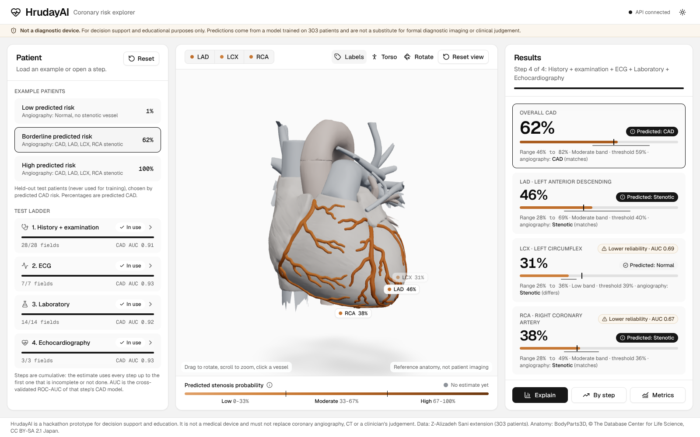

# HrudayAI

Multimodal AI Hackathon 2026, Track A: cardiovascular risk visualization and prediction.

HrudayAI estimates the probability of coronary artery disease (CAD) and of stenosis in the three
main coronary arteries (LAD, LCX, RCA) from clinical, ECG, laboratory and echo findings. It shows
the estimates on an interactive 3D heart with the real coronary arteries, explains each one with
SHAP, and reports how reliable each model is.

> **Not a diagnostic device.** For decision support and education only. The models are trained
> on 303 patients from one centre and are not clinically validated. Nothing here replaces
> coronary angiography, CT or a clinician's judgement.



## What it does

- **Four targets, calibrated:** overall CAD plus LAD, LCX and RCA stenosis, each from a
  Platt-calibrated logistic regression with a tuned decision threshold.
- **Test ladder:** predictions at four cumulative steps (history and examination, then ECG, labs,
  echo), so a clinic without an echo machine still gets an estimate. Every step has its own
  validated model.
- **Honest uncertainty:** each probability comes with a 10th to 90th percentile range from 200
  bootstrap refits, and weaker models carry a "lower reliability" tag with their metrics.
- **3D heart:** BodyParts3D anatomy with the LAD, LCX and RCA as separate, selectable meshes
  coloured by predicted probability.
- **Explanations:** exact SHAP contributions per patient, reported on the original measurements.

## Requirements

- Python 3.12 with [uv](https://docs.astral.sh/uv/)
- Node.js 20 or newer
- `make`

Everything runs locally on CPU.

## Quick start

```bash
make setup     # uv sync + npm install
make serve     # API on http://localhost:8000 (docs at /docs)
make web       # in a second terminal: app on http://localhost:3000
```

The trained models and reports are committed, so the app works without retraining.

## Retraining

```bash
make train     # main models, metrics, plots, SHAP reports, then the test ladder
make ladder    # only the 16 ladder models and reports/ladder_metrics.json
make test      # leakage-guard tests
make lint      # ruff, eslint and tsc
```

`make train` is seeded and regenerates `models/`, `reports/metrics.json`,
`reports/ladder_metrics.json` and `reports/plots/`. The ladder step takes several minutes.

## Results

Hold-out set: 61 patients never used for training. Cross-validation: 5 folds x 5 repeats on the
other 242. Source: `reports/metrics.json`.

| Target | CV ROC-AUC | Hold-out ROC-AUC (95% CI) | Hold-out F1 | Hold-out Brier |
|---|---|---|---|---|
| CAD | 0.925 ± 0.033 | 0.872 (0.773 to 0.946) | 0.843 | 0.143 |
| LAD | 0.837 ± 0.056 | 0.818 (0.703 to 0.908) | 0.757 | 0.187 |
| LCX | 0.716 ± 0.064 | 0.686 (0.536 to 0.816) | 0.577 | 0.222 |
| RCA | 0.740 ± 0.074 | 0.671 (0.523 to 0.806) | 0.536 | 0.216 |

LCX and RCA are weak and are tagged "lower reliability" throughout the app. See
[docs/DOCUMENTATION.md](docs/DOCUMENTATION.md) for the method, the per-step results and the
limitations.

## API

| Endpoint | Purpose |
|---|---|
| `GET /health` | Service status and loaded models |
| `GET /schema` | Input features (type, range, unit, group, default, ladder step), targets, display bands |
| `GET /ladder` | Ladder steps, the inputs each needs, and per-step metrics |
| `POST /predict?stage=&top_n=` | Probabilities, ranges, labels and SHAP for one patient; input may be partial |
| `GET /metrics` | Saved evaluation results and global SHAP importance |
| `GET /examples` | Three real held-out patients (low, borderline, high predicted risk) |

```bash
curl -s localhost:8000/examples | python3 -c \
  "import json,sys; print(json.dumps(json.load(sys.stdin)['examples'][1]['features']))" > patient.json
curl -s -X POST "localhost:8000/predict?top_n=3" -H 'Content-Type: application/json' -d @patient.json
```

## Repository layout

```
backend/
  ml/                 pipeline: schema, preprocessing, models, CV, calibration, SHAP, ladder
    feature_schema.json   every input feature and the ladder steps (single source of truth)
  api/                FastAPI app (main.py, service.py, schemas.py, settings.py)
  tests/              leakage-guard tests
frontend/             Next.js + TypeScript + Tailwind + shadcn/ui + React Three Fiber
  components/heart/   3D scene
  components/patient/ example patients, ladder steps, step dialog
  components/results/ estimates, explanation, by-step chart, metrics
  public/models/      heart.glb
data/raw/             source dataset (.xlsx)
models/               trained models (models/ladder/ for the per-step models)
reports/              metrics, audits and plots written by training
tools/heart_model/    script and licence notice for the 3D heart
docs/                 documentation, demo script, ideation, screenshots
```

## Extending

- **New input feature:** add one entry to `backend/ml/feature_schema.json`, then retrain. The
  API validation and the form follow the schema.
- **New target or vessel:** add one `TargetSpec` in `backend/ml/config.py`, retrain, and, for a
  vessel, add a mesh of the same name to the heart model plus one entry in
  `frontend/lib/heart/anatomy.ts`.
- **Ladder steps:** edit the `stages` list in the schema.

## Data, model and licence credits

- **Dataset:** Extension of the Z-Alizadeh Sani dataset (UCI Machine Learning Repository),
  303 patients. The supplied Apple Numbers file was converted once to
  `data/raw/z_alizadeh_sani_extension.xlsx`.
- **3D anatomy:** BodyParts3D, © The Database Center for Life Science, licensed under
  CC BY-SA 2.1 Japan. `frontend/public/models/heart.glb` is a derivative under the same licence;
  see `tools/heart_model/NOTICE.md`.
- **UI components:** shadcn/ui (MIT), Radix UI, lucide icons, Geist typeface.

## Documentation

- [docs/DOCUMENTATION.md](docs/DOCUMENTATION.md): project documentation (also as PDF)
- [docs/DEMO_SCRIPT.md](docs/DEMO_SCRIPT.md): demo video script
- [docs/IDEATION.md](docs/IDEATION.md): product ideation notes
- [PLAN.md](PLAN.md): build plan and phase checklist
