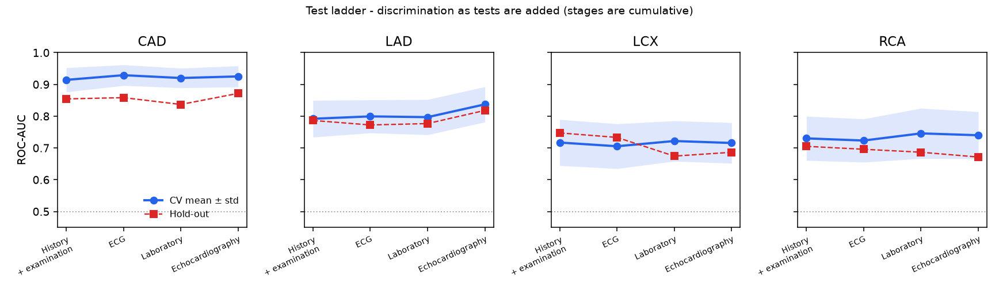

# HrudayAI: project documentation

Multimodal AI Hackathon 2026, Track A (cardiovascular risk visualization and prediction).

**Not a diagnostic device.** HrudayAI is a decision-support and educational prototype. Every number below comes from files written by the training code (`reports/*.json`); nothing is clinically validated.

## 1. What the system does

HrudayAI takes a patient's clinical, ECG, laboratory and echocardiography findings and estimates four probabilities: overall coronary artery disease (CAD) and stenosis of the left anterior descending (LAD), left circumflex (LCX) and right coronary (RCA) arteries. The estimates are drawn on an interactive 3D heart whose coronary arteries are separate meshes, each explained with SHAP, and each shown with a range and a reliability tag.

It works in four cumulative steps, the *test ladder*: history and examination, then ECG, then laboratory tests, then echo. A clinic that has only the first step still gets an estimate from a model validated for that step.


## 2. Dataset and preprocessing

**Dataset.** Extension of the Z-Alizadeh Sani dataset (UCI): 303 patients, 59 columns, no missing values and no duplicate rows. The file was supplied as an Apple Numbers document and converted once to `.xlsx`.

**Targets.** `Cath` (CAD / Normal) is the overall CAD label; `LAD`, `LCX` and `RCA` (Stenotic / Normal) are the vessel labels. Class balance: CAD 216 of 303 positive (71%), LAD 177 (58%), LCX 119 (39%), RCA 114 (38%). One patient has a stenotic vessel but a Normal `Cath` label; it is kept as recorded.

**Leakage control.** `LAD`, `LCX`, `RCA` and `Cath` are never model inputs for any target. This is enforced in one place (the feature schema) and checked by tests, including one that scrambles those columns and confirms predictions do not change.

**Inputs.** 54 features remain: 21 numeric, 29 two-valued, 3 ordered (function class, regions with wall-motion abnormality, valvular disease) and 1 nominal (bundle branch block). `Exertional CP` is dropped because it is constant. All features are declared in `backend/ml/feature_schema.json` with type, range, unit, group, label and ladder step; preprocessing, API validation and the input form are generated from that file.

**Pipeline.** A schema-driven encoder validates values and codes two-valued and ordered features as integers; numeric features are standardised; the nominal feature is one-hot encoded with fixed categories. All of it lives inside the scikit-learn pipeline, so it is refitted on training folds only. BMI and the obesity flag are computed from weight and height at prediction time, so a request cannot carry an inconsistent value.

**Feature checks** (`reports/feature_checks.json`). No single feature separates any target with ROC-AUC above 0.80 (typical chest pain reaches 0.80 for CAD), so there is no sign of a leaked label. BMI is exactly weight / height²; the obesity flag agrees with BMI > 25 in 99.7% of rows; lymphocytes and neutrophils are strongly inversely correlated (−0.91). Eight two-valued features have fewer than 10 positive cases.

## 3. Models and selection

**Candidates.** For each target: L2 logistic regression (regularisation strength chosen by an inner cross-validation), random forest, XGBoost and LightGBM, the tree models shallow and strongly regularised with hyperparameters fixed in advance. A soft-voting ensemble is reported for reference. Class imbalance is handled with class-balanced sample weights for every model.

**Selection rule.** Pick the best model by cross-validated ROC-AUC, but prefer a simpler model when the difference is within noise, judged by the Nadeau-Bengio corrected resampled t-test on paired fold scores (p > 0.05 counts as a tie).

| Target | Logistic regression | Random forest | LightGBM | XGBoost | p (logistic vs best) |
|---|---|---|---|---|---|
| CAD | 0.925 | 0.945 | 0.946 | 0.942 | 0.29 |
| LAD | 0.837 | 0.864 | 0.862 | 0.855 | 0.22 |
| LCX | 0.716 | 0.728 | 0.730 | 0.733 | 0.51 |
| RCA | 0.740 | 0.735 | 0.739 | 0.725 | best |

*Mean cross-validated ROC-AUC.* Tree models lead by up to 0.027 on three targets, but never by more than noise, so **logistic regression is used for all four targets**. It also gives exact SHAP values and smooth probabilities.

**Calibration.** Probabilities drive the colours, so they are calibrated. Platt scaling and isotonic regression were compared on out-of-fold scores; Platt had the lower cross-validated Brier score for every target (for CAD: 0.096 against 0.098 isotonic and 0.107 uncalibrated) and is used throughout.

**Decision threshold.** After calibration 0.5 is the wrong cut-off for the less common classes, so each model's threshold is tuned (Youden's J) on out-of-fold training predictions: 0.59 for CAD, 0.40 LAD, 0.39 LCX, 0.36 RCA.

## 4. Validation method

- **Hold-out:** one stratified 20% split (61 patients), shared by all targets and touched only for the final report.
- **Cross-validation:** 5 folds x 5 repeats, stratified, on the other 242 patients. Preprocessing, model fitting, calibration and threshold tuning are all repeated inside every fold.
- **Uncertainty:** standard deviation over the 25 folds; a 2,000-sample bootstrap 95% interval for hold-out ROC-AUC.
- **Reproducibility:** fixed seed; two consecutive runs produced byte-identical `metrics.json`.

## 5. Results

**Full models (all 54 inputs).** Source: `reports/metrics.json`. CV columns are mean ± standard deviation; hold-out columns are at the tuned threshold.

| Target | CV ROC-AUC | CV accuracy | CV precision | CV recall | CV F1 | Hold-out ROC-AUC (95% CI) | Hold-out acc. | Hold-out F1 | Hold-out Brier |
|---|---|---|---|---|---|---|---|---|---|
| CAD | 0.925 ± 0.033 | 0.870 | 0.923 | 0.894 | 0.907 | 0.872 (0.77 to 0.95) | 0.787 | 0.843 | 0.143 |
| LAD | 0.837 ± 0.056 | 0.725 | 0.790 | 0.740 | 0.757 | 0.818 (0.70 to 0.91) | 0.705 | 0.757 | 0.187 |
| LCX | 0.716 ± 0.064 | 0.660 | 0.548 | 0.678 | 0.601 | 0.686 (0.54 to 0.82) | 0.639 | 0.577 | 0.222 |
| RCA | 0.740 ± 0.074 | 0.660 | 0.545 | 0.750 | 0.624 | 0.671 (0.52 to 0.81) | 0.574 | 0.536 | 0.216 |

CAD and LAD are predicted reasonably. LCX and RCA are weak: their hold-out intervals reach down to about 0.52 to 0.54, close to chance. Hold-out ROC-AUC is below the cross-validated mean for every target. On the hold-out set the CAD model misses 9 of 44 patients with CAD and flags 13 of 17 without it.

**Test ladder.** Sixteen models (four steps x four targets), validated with the same protocol. Source: `reports/ladder_metrics.json`.

| Target | Step 1: history + exam | Step 2: + ECG | Step 3: + labs | Step 4: + echo |
|---|---|---|---|---|
| CAD | 0.914 / 0.854 | 0.929 / 0.858 | 0.920 / 0.837 | 0.925 / 0.872 |
| LAD | 0.792 / 0.786 | 0.799 / 0.772 | 0.797 / 0.777 | **0.837** / 0.818 |
| LCX | 0.717 / 0.747 | 0.705 / 0.733 | 0.722 / 0.674 | 0.716 / 0.686 |
| RCA | 0.730 / 0.705 | 0.723 / 0.696 | 0.746 / 0.686 | 0.740 / 0.671 |

*Cross-validated ROC-AUC / hold-out ROC-AUC.* The finding is not the one we expected. History and examination alone carry most of the signal. Of the twelve step-to-step changes, only one is distinguishable from noise: echo for LAD (+0.040, p = 0.01, in bold). Laboratory tests add nothing measurable for any target. The app states this in its performance view; it does not suggest that more tests give a better estimate. Step 4 reproduces the full models exactly (maximum difference 0.0 on the hold-out patients).

**Ranges.** For each step model, 200 bootstrap refits give a 10th to 90th percentile range around each probability. The calibration map is held fixed across refits, so the range reflects how much the fitted coefficients depend on the training sample, not calibration error or differences between populations. Ranges do not narrow as tests are added, and a narrow range is not evidence of accuracy: the LCX model's range is narrow at step 4 only because that model is so heavily regularised that it barely moves from the base rate.



## 6. Explainability

SHAP values are computed with the explainer matched to the model type (the linear explainer here; tree explainers are supported) and summed back from encoded columns to the original measurements. For every prediction the API returns each feature's value, its SHAP value in log-odds, and a "probability impact" in percentage points. The impact is the SHAP values rescaled so that they add up to the difference between the patient's probability and that of the average training patient; SHAP values themselves are exactly additive (checked to within 1e-13 on all hold-out patients).

Globally (mean absolute SHAP), the CAD model leans on regions with wall-motion abnormality (0.86), typical chest pain (0.81), age (0.64) and triglycerides (0.53); LAD on wall-motion abnormality, age, typical chest pain and ejection fraction. LCX contributions are all small (largest 0.19, age), consistent with its weak model. Explanations describe how the model weighs inputs; they are associations, not causes.

## 7. 3D pipeline

**Anatomy.** The heart is built from BodyParts3D (© The Database Center for Life Science, CC BY-SA 2.1 Japan): heart wall, aorta, pulmonary vessels, venae cavae and, as separate parts, the coronary arteries. A script (`tools/heart_model/build_heart_model.py`) merges parts per structure, crops the pulmonary trees to their trunks, simplifies about 590,000 triangles to about 75,000, and exports glTF, compressed with meshopt to 351 KB.

**Mapping.** Each of LAD, LCX and RCA is one named mesh whose name equals a model target, so predictions map to anatomy by name. Segments are never coloured separately, because the models predict per vessel. Colour comes from a single-hue scale ordered by lightness (checked with a palette validator for colour-vision deficiency) with separate steps for light and dark themes; the probability, range and predicted label are always shown as text. A vessel is drawn more translucent when its range is wide or its model is tagged lower reliability.

**Interaction and cost.** Orbit, zoom, limited pan, hover and click picking with occlusion, eased camera focus, reset, per-vessel toggles, labels and an optional torso outline. Frames are rendered only on change, pixel ratio is capped at 1.5, and there are no shadow maps or post-processing. The anatomy is one reference body, not the patient's imaging, and the canvas says so.

## 8. System architecture

```
feature_schema.json ──> preprocessing ──> train.py / ladder.py ──> models/*.joblib, reports/*.json
        │                                                              │
        └──> FastAPI (schema, ladder, predict, metrics, examples) <────┘
                         │  JSON
                 Next.js app: patient steps │ 3D heart (React Three Fiber) │ results + dialogs
```

- **Backend:** Python 3.12, scikit-learn, SHAP, FastAPI, Pydantic. Models load once at start-up; a prediction with explanations takes about 50 ms.
- **Frontend:** Next.js (App Router), TypeScript, Tailwind, shadcn/ui components, React Three Fiber, Recharts. The form, the ladder steps and the target list are all read from the API.
- **Extending:** a new input is one schema entry; a new target is one configuration entry plus, for a vessel, a mesh of the same name.

## 9. Usage

`make setup`, then `make serve` (API on port 8000) and `make web` (app on port 3000). Load one of three real held-out example patients, or open a ladder step and enter values; estimates update as inputs change. Click a vessel or a result tile to select it, then "Explain" for its SHAP breakdown, "By step" for how the estimates moved up the ladder, and "Metrics" for the saved validation results. `make train` regenerates every model, report and plot.

## 10. Limitations

- **Small, single-centre data.** 303 patients, 61 in the hold-out set. All intervals are wide. To our knowledge the data comes from one centre in Iran, so performance in any other population, including India, is unknown.
- **Referred patients only.** Everyone in the dataset was already sent for angiography. The models estimate CAD among such patients, not risk in the general population, and they are not a tool for acute chest pain.
- **Weak vessel models.** LCX and RCA are close to chance on the hold-out set.
- **No external validation.** No second dataset was used.
- **Per-vessel only.** There is no information on where in a vessel a lesion lies, and the 3D heart is reference anatomy.
- **Ladder order is fixed.** A step can be skipped only by stopping the ladder there.
- **Not measured.** Frame rate on real hardware was not measured; the app was checked in a headless browser with software rendering.

## 11. Ethics and safety

- A disclaimer is always visible; the app never recommends a test or a treatment.
- Uncertainty and weak performance are shown, not hidden: ranges, reliability tags and the finding that extra tests rarely help are all in the interface.
- Explanations are labelled as model behaviour, not causes, and there is no "what would lower my risk" feature, because the model's associations are not treatment effects.
- No patient data is stored; the example patients come from the public, de-identified dataset.
- Before any real use the system would need external validation, a subgroup audit (for example by sex and age) and clinical review.
